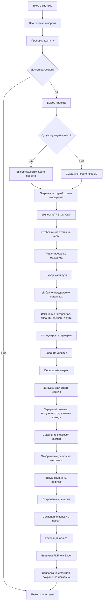

# 📊 Диаграмма активности системы

## 📝 Описание процесса

Основные этапы работы с системой:

1. **🔐 Авторизация**
   - Проверка доступа пользователя.

2. **📁 Управление проектами**
   - Создание/выбор проекта.
   - Загрузка данных (GTFS/CSV) и визуализация маршрутов на карте.

3. **✏️ Редактирование маршрутов**
   - Добавление/удаление остановок.
   - Настройка параметров: интервалы, тип транспорта, время в пути.

4. **🧪 Сценарии**
   - Формулировка условий (рост населения, перекрытие улиц и т.д.).
   - Автоматический перерасчет метрик: охват, загруженность, время поездки.

5. **📊 Аналитика**
   - Сравнение с базовой схемой.
   - Визуализация изменений на графиках.

6. **🧾 Отчетность**
   - Генерация отчетов (PDF/Excel).
   - Сохранение или отправка результатов.
