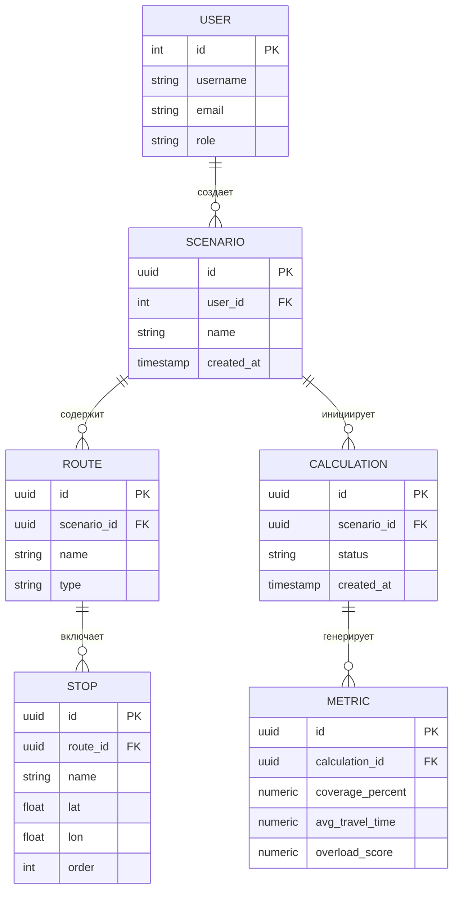

# ER-диаграмма

## 🔗 Описание связей между сущностями

### 🧑 USER → 📁 SCENARIO  
Один пользователь может создавать множество сценариев (**1:N**).

### 📁 SCENARIO → 🛣️ ROUTE  
В одном сценарии может быть несколько маршрутов (**1:N**).

### 🛣️ ROUTE → ⛔ STOP  
Каждый маршрут включает несколько остановок (**1:N**).

### 📁 SCENARIO → 🧮 CALCULATION  
Для сценария можно запустить множество расчётов (**1:N**).

### 🧮 CALCULATION → 📈 METRIC  
Каждый расчёт генерирует метрики (**1:1** или **1:N**, в зависимости от реализации).

---

### ⚙️ Особенности реализации

- **Идентификаторы (id)** используют тип `UUID` для глобальной уникальности.
- **Внешние ключи (FK)** обеспечивают ссылочную целостность:
  - Удаление сценария **каскадно** удаляет связанные маршруты и расчёты.
  - Удаление маршрута **каскадно** удаляет его остановки.
- Поля `lat` и `lon` в сущности **STOP** хранят географические координаты.
- Статус расчёта (`status`) может принимать значения:
  - `queued` ⏳
  - `processing` 🔄
  - `done` ✅
  - `error` ❌
