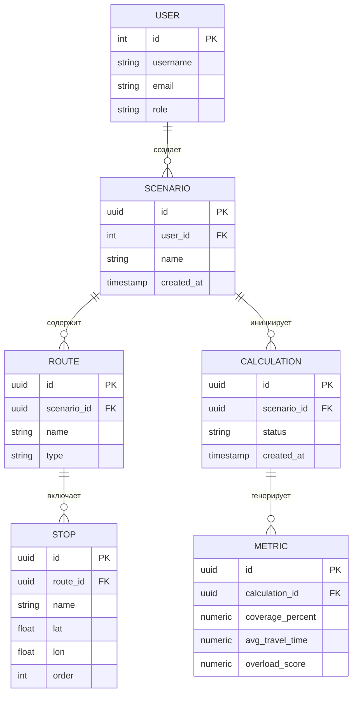

# ER-диаграмма

```mermaid
erDiagram
    USER ||--o{ SCENARIO : "создает"
    USER {
        int id PK
        string username
        string email
        string role
    }

    SCENARIO ||--o{ ROUTE : "содержит"
    SCENARIO ||--o{ CALCULATION : "инициирует"
    SCENARIO {
        uuid id PK
        int user_id FK
        string name
        timestamp created_at
    }

    ROUTE ||--o{ STOP : "включает"
    ROUTE {
        uuid id PK
        uuid scenario_id FK
        string name
        string type
    }

    STOP {
        uuid id PK
        uuid route_id FK
        string name
        float lat
        float lon
        int order
    }

    CALCULATION ||--o{ METRIC : "генерирует"
    CALCULATION {
        uuid id PK
        uuid scenario_id FK
        string status
        timestamp created_at
    }

    METRIC {
        uuid id PK
        uuid calculation_id FK
        numeric coverage_percent
        numeric avg_travel_time
        numeric overload_score
    }
```
