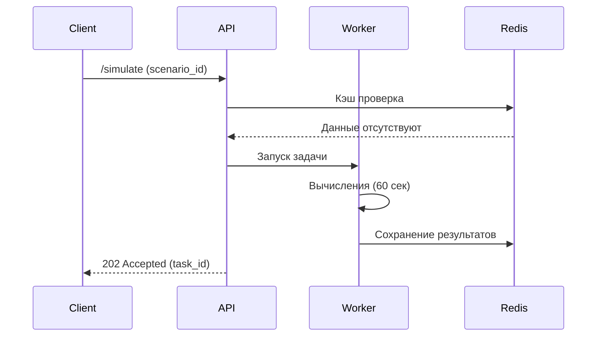

# 🧩 Системные компоненты

## Сервис сценариев

### API Endpoints
```http
POST /api/v1/scenarios
Content-Type: multipart/form-data

{
  "file": "transport_data.gtfs",
  "params": {
    "city": "MOSCOW",
    "projection": "EPSG:3857"
  }
}
```

```http
GET /api/v1/scenarios/{id}/status
Authorization: Bearer <token>
```

### База данных
```sql
CREATE TABLE scenarios (
    id UUID PRIMARY KEY,
    owner_id UUID REFERENCES users(id),
    geodata GEOMETRY(Geometry, 3857),
    created_at TIMESTAMPTZ DEFAULT NOW()
);
```

## Сервис расчетов

### Формулы метрик
**Индекс перегруженности**:
```math
Overload = \frac{\sum (passengers_i / capacity_i)}{total\_routes}
```

**Среднее время в пути**:
```math
AvgTime = \frac{\sum (t_{arrival} - t_{departure})}{total\_trips}
```

### Архитектура вычислений


## Интеграции
**Картографические провайдеры**:
- OpenStreetMap (основной)
- Google Maps API (опционально)
- Yandex Maps (для РФ)

**Стандарты данных**:
- GTFS v2.0+ (транспорт)
- GeoJSON (экспорт)
- CityGML (3D модели)
