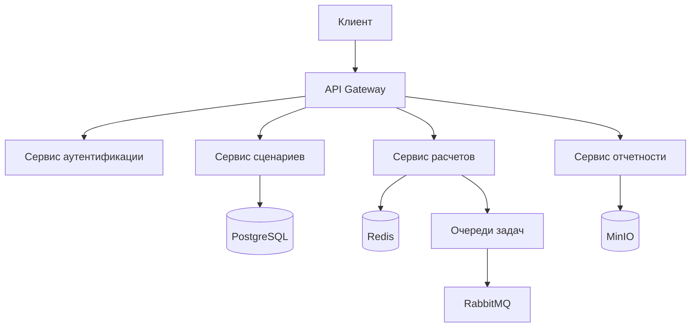

# 🏗 Концептуальная архитектура CitySim

Ключевые элементы:
API Gateway: Единая точка входа для всех запросов

Сервисы: Разделение по бизнес-логике

Хранилища: Оптимизированные под разные типы данных

Интеграции: Внешние системы и очереди задач
