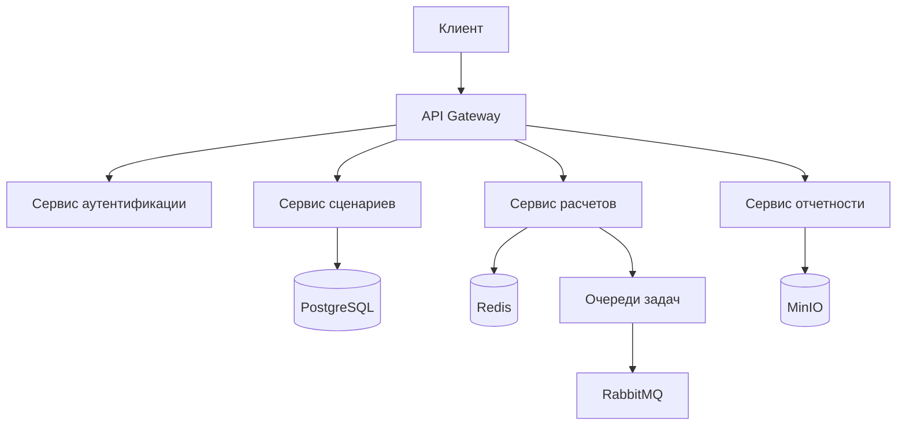

# 🏗 Концептуальная архитектура CitySim

## Основные характеристики системы

### 1.1 Компоненты ядра
| Компонент              | Назначение                                  | Технологии             |
|------------------------|---------------------------------------------|------------------------|
| **API Gateway**        | Единая точка входа для всех запросов        | FastAPI, OpenAPI 3.0   |
| **Сервис сценариев**   | Управление транспортными схемами            | Python 3.10, PostGIS   |
| **Сервис расчетов**    | Выполнение симуляций                        | Celery, Pandas         |
| **Сервис отчетности**  | Генерация аналитических выводов             | Chart.js, PDFKit       |

### 1.2 Ключевые принципы
- **Микросервисная архитектура**: Независимое масштабирование компонентов
- **Event-Driven**: Асинхронная обработка через RabbitMQ
- **Security-by-Design**: 
  - JWT с 15-минутным TTL
  - Шифрование данных AES-256
- **High Availability**:
  - Кластеризация PostgreSQL
  - Репликация в MinIO
