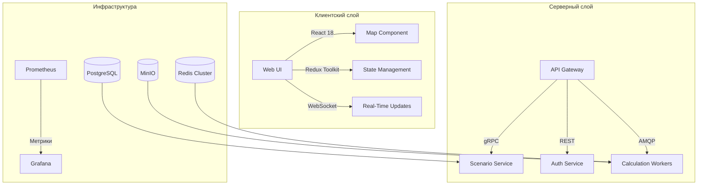
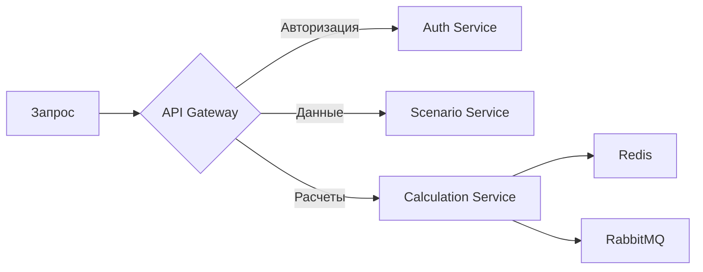

# 🔍 Детализированная архитектура CitySim

## 2.1 Технологический стек

### Frontend
| Компонент          | Технологии                  | Назначение                     |
|--------------------|-----------------------------|--------------------------------|
| Картография        | Deck.gl, OpenLayers         | Визуализация транспортных сетей |
| Аналитика          | Chart.js, D3.js             | Построение графиков и диаграмм  |
| State Management   | Redux Toolkit               | Управление сложными состояниями |

### Backend

## 2.2 Производительность
- **Обработка запросов**: ≤500 мс (p99)
- **Параллелизм**: 1000+ одновременных сессий
- **Нагрузка**: 10k RPM на кластере из 3 нод
