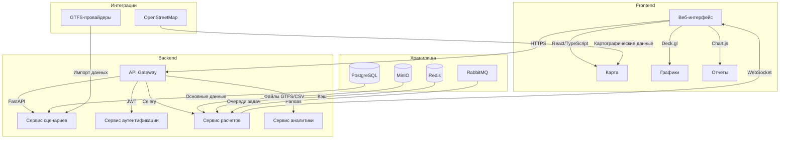

# 🏗 Концептуальная архитектура CitySim🔍 Детализированная архитектура CitySim

Технологический стек:
Компонент	Технологии
Frontend	React, TypeScript, Deck.gl, Chart.js
API Gateway	FastAPI, OpenAPI 3.0
Сервисы	Python 3.10+, SQLAlchemy, Celery
Хранилища	PostgreSQL, Redis, MinIO
