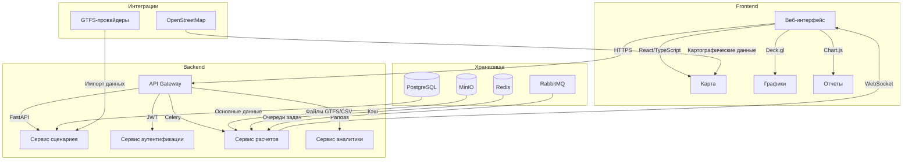
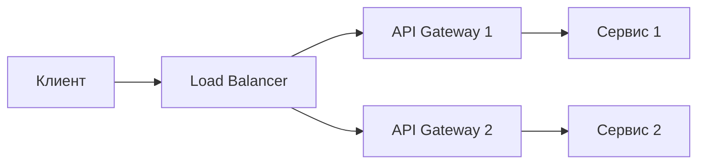

# 🔍 Детализированная архитектура CitySim



## Технологический стек

### Слои архитектуры
| Компонент          | Технологии                          | Версия      |
|--------------------|-------------------------------------|-------------|
| **Frontend**       | React, TypeScript                   | 18.x, 5.0+  |
| **Картография**    | Deck.gl, OpenLayers                 | 8.8+, 7.3+  |
| **Визуализация**   | Chart.js, D3.js                     | 4.3+, 7.8+  |
| **API Gateway**    | FastAPI, OpenAPI 3.0                | 0.103+      |
| **Сервисы**        | Python, SQLAlchemy, Celery          | 3.10+, 2.0+ |

### Системные характеристики
| Параметр                  | Значение                       |
|---------------------------|--------------------------------|
| Время обработки запроса   | <500 мс (p95)                  |
| Параллельные сессии       | до 1000                        |
| Размер обрабатываемых данных | до 50 ГБ на сценарий       |

## Принципы проектирования

### 1. Модульность компонентов
- **Изолированные сервисы**: Каждый компонент развертывается независимо
- **Четкие контракты**: 
  - OpenAPI-спецификация для REST
  - Protobuf-схемы для gRPC
- **Событийная модель**: Обработка через RabbitMQ с подтверждением доставки

### 2. Безопасность
- **Аутентификация**: JWT с 15-минутным TTL + refresh-токены
- **Шифрование**: 
  - TLS 1.3 для передачи данных
  - AES-256 для хранилища
- **Ролевая модель**: 
  ```mermaid
  flowchart LR
    A[Администратор] --> B[Полный доступ]
    C[Аналитик] --> D[Создание/редактирование]
    E[Наблюдатель] --> F[Только чтение]
  ```

### 3. Мониторинг и логирование
- **Метрики в реальном времени**:
  - Загрузка CPU/GPU
  - Использование памяти
  - Latency API-вызовов
- **Централизованные логи**: ELK-стек (Elasticsearch, Logstash, Kibana)

## Стратегия масштабирования

### Горизонтальное масштабирование


### Репликация данных
| Хранилище       | Стратегия                      | RTO/RPO        |
|-----------------|--------------------------------|----------------|
| PostgreSQL      | Streaming Replication          | <30 сек/<1 мин |
| Redis           | Cluster Mode                   | <1 сек         |
| MinIO           | Erasure Coding                 | 0/0            |

## Roadmap развития
- Q3 2025: Интеграция с системами IoT
- Q4 2025: Поддержка предиктивной аналитики (ML)
- Q1 2026: Реализация мультитенантности
