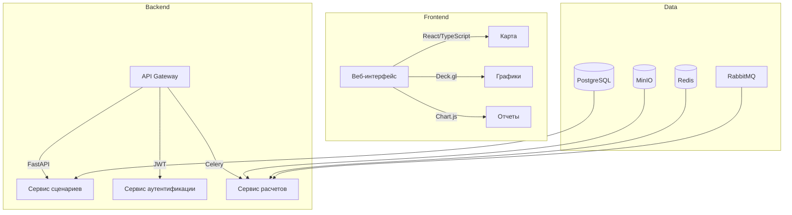

---

### 2. Файл `DETAILED.md`:
```markdown
# 🔍 Детализированная архитектура CitySim
```


```mermaid
graph TD
    subgraph Frontend
        A[Веб-интерфейс] -->|React/TypeScript| B[Карта]
        A -->|Deck.gl| C[Графики]
        A -->|Chart.js| D[Отчеты]
    end

    subgraph Backend
        E[API Gateway] -->|FastAPI| F[Сервис сценариев]
        E -->|JWT| G[Сервис аутентификации]
        E -->|Celery| H[Сервис расчетов]
    end

    subgraph Data
        I[(PostgreSQL)] --> F
        J[(MinIO)] --> H
        K[(Redis)] --> H
        L[RabbitMQ] --> H
    end
```

Технологический стек:
Компонент	Технологии
Frontend	React, TypeScript, Deck.gl, Chart.js
API Gateway	FastAPI, OpenAPI 3.0
Сервисы	Python 3.10+, SQLAlchemy, Celery
Хранилища	PostgreSQL, Redis, MinIO
