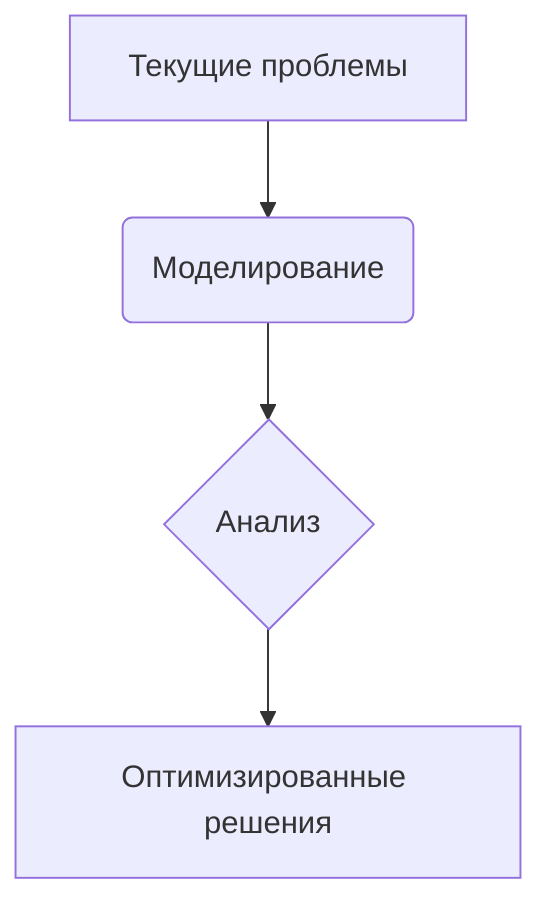
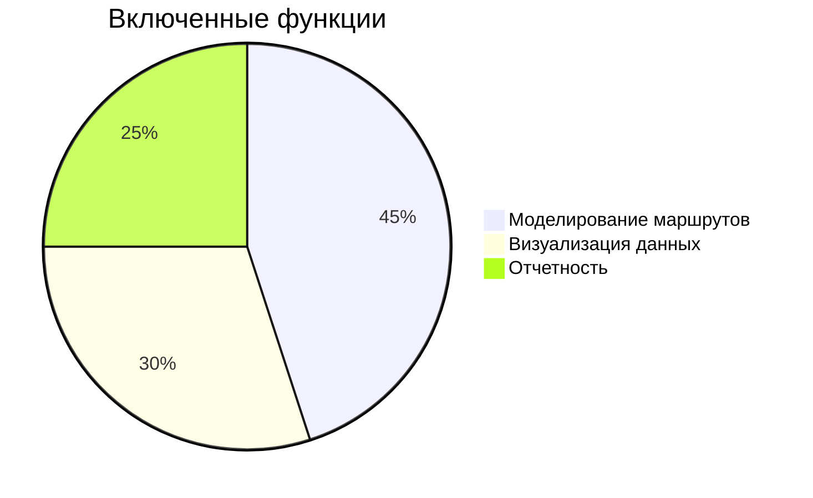
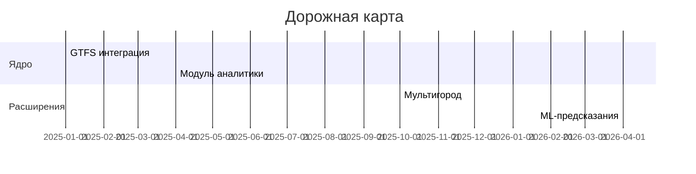

# 🧭 Концепция и границы проекта CitySim

## 🌟 Видение

**Городская транспортная система 2.0**  
Инструмент для доказательного проектирования транспортных сетей, позволяющий:
- Проводить комплексный анализ текущей инфраструктуры
- Тестировать гипотезы в виртуальной среде
- Снижать риски дорогостоящих ошибок

---

## 🎯 Бизнес-потребности

- Сокращение времени утверждения изменений маршрутов на **40%**
- Увеличение пассажиропотока на **15%** через оптимизацию сети
- Снижение эксплуатационных расходов на **25%** за счёт анализа

---

## 🔍 Проблемы и возможности

| Проблема                        | Возможность                    |
|---------------------------------|--------------------------------|
| Устаревшие методы планирования  | Цифровое моделирование         |
| Неэффективное использование данных | Интеграция с GTFS/OpenData     |
| Длительный цикл согласований    | Интерактивная визуализация     |

---

## 🧩 Основные возможности

### Ядро системы
- 🗺️ Импорт транспортных схем (GTFS/CSV)
- ✏️ Редактор маршрутов с поддержкой 3D-карт
- 📊 Сравнение сценариев в реальном времени

### Аналитика
- 🔍 Выявление "мертвых зон" покрытия
- 🕒 Прогнозирование времени в пути
- 📈 Анализ загруженности по часам

---

## 🗺 Границы проекта

### In Scope

### Out of Scope
- Реальное управление транспортом
- Интеграция с системами биллинга
- Мобильные приложения (на текущем этапе)

---

## 👥 Целевая аудитория

| Роль                 | Потребности                         |
|----------------------|--------------------------------------|
| Муниципалитет        | Обоснование бюджетных расходов       |
| Транспортные операторы | Оптимизация расписаний              |
| Урбанисты            | Проектирование городской инфраструктуры |

---

## ⚠️ Ключевые риски

- **Качество данных**: Неполные GTFS-фиды  
- **Производительность**: Ограничения при работе с мегаполисами  
- **Принятие**: Сопротивление изменениям в рабочих процессах  

---

## 🎯 Критерии успеха

| Метрика                         | Целевое значение | Срок       |
|----------------------------------|------------------|------------|
| Уменьшение времени моделирования | ≤15 мин          | Q3 2025    |
| Количество смоделированных сценариев | 100+/мес     | Q4 2025    |
| Снижение жалоб пассажиров        | 20%              | 2026       |

---

## 🔮 Стратегия развития

---

## 📚 Полезные ссылки

- 📄 **Бизнес-требования** — [business.md](./business.md)
- 👥 **Пользовательские требования** — [user.md](./user.md)

---

## ✅ Соответствие рекомендациям Вигерса

1. **Бизнес-ориентированность**: Четкая связь с ROI и KPI  
2. **Сбалансированность**: Учтены технические и организационные аспекты  
3. **Измеримость**: Конкретные метрики успеха  
4. **Гибкость**: Четкие границы с возможностью расширения  
5. **Визуальная ясность**: Использование Mermaid для диаграмм  

---

## ✨ Дополнительные улучшения

- Интерактивные ссылки на связанные документы  
- Компактное представление сложных концепций  
- Интеграция временных рамок в дорожную карту  
- Явное разделение текущих и будущих возможностей  

# 🗺️ Объем проекта

## ✅ Входит в текущую версию
1. **Географическое покрытие**:
   - Моделирование маршрутов в пределах одного города
   - Поддержка до 500 одновременных маршрутов

2. **Типы транспорта**:
   - Автобусы
   - Трамваи
   - Метро
   - Электрички (при наличии данных GTFS)

3. **Основной функционал**:
   - Загрузка схем в форматах GTFS/CSV
   - Визуализация на интерактивной карте
   - Сравнение метрик "до/после" изменений
   - Генерация PDF/Excel отчетов

## 🚫 Не входит в текущую версию
1. **Интеграции**:
   - Управление транспортом в реальном времени
   - GPS-трекинг транспортных средств
   - Системы продажи билетов

2. **Расширенные возможности**:
   - Мобильное приложение
   - Предиктивная аналитика на основе ML
   - Моделирование частного транспорта

## 🔮 Возможные расширения
1. Поддержка нескольких городов (мультирегиональность)
2. Включение в модель:
   - Велосипедные маршруты
   - Каршеринг и такси
   - Грузовые перевозки
3. Интеграция с системами IoT для сбора данных в реальном времени
