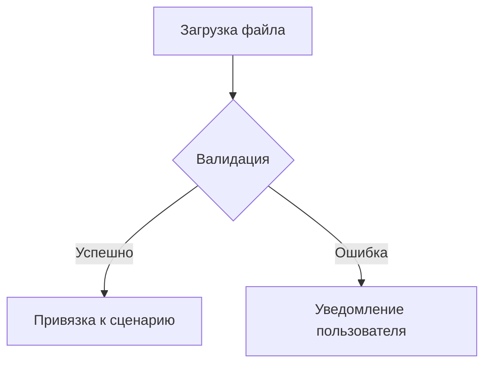
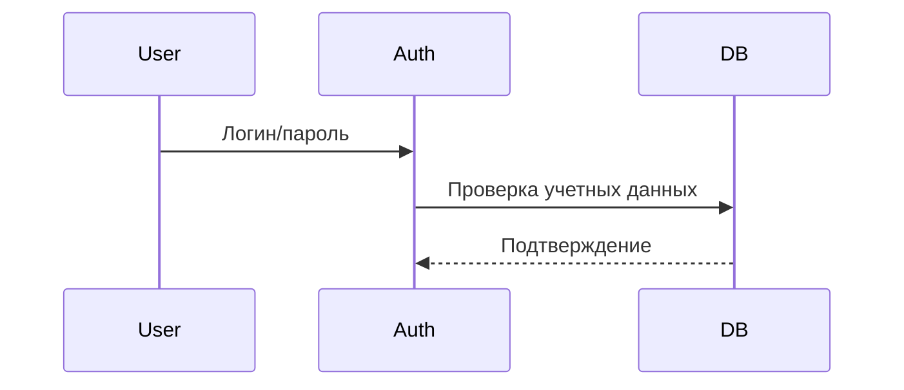

# 👤 Пользовательские требования

## 🔸 UR1. Работа с данными

### Импорт/экспорт

**UR1.1.** Пользователь может загружать файлы маршрутов в форматах:
- GTFS (стандарт Google Transit)
- CSV с предопределенной структурой:

```csv
route_id,stop_id,sequence,lat,lon
1,A1,1,55.7522,37.6156
```

**UR1.2.** Привязка файла к сценарию через:
- Выбор существующего проекта
- Создание нового сценария
- Автоматическое распознавание типа транспорта



---

## 🔸 UR2. Моделирование через API

### Работа с симуляциями

**UR2.1.** Запуск моделирования:

```http
POST /api/v1/simulations
Authorization: Bearer <token>
Content-Type: application/json

{
  "scenario_id": "550e8400-e29b-41d4-a716-446655440000",
  "parameters": {
    "time_range": "07:00-10:00",
    "population_density": "high"
  }
}
```

**UR2.2.** Получение результатов:

```http
GET /api/v1/simulations/{id}/results
Authorization: Bearer <token>
```

Пример ответа:

```json
{
  "metrics": {
    "coverage": 85.3,
    "avg_travel_time": 28.4,
    "overload_stations": ["A12", "B7"]
  }
}
```

---

## 🔸 UR3. Управление доступом

### Роли и права

| Роль         | Возможности                     | Ограничения                  |
|--------------|----------------------------------|------------------------------|
| Администратор | Управление пользователями       | Нет                          |
| Аналитик      | Запуск симуляций, экспорт данных | Не может удалять сценарии    |
| Наблюдатель   | Просмотр отчетов                | Только read-only доступ      |

### Процесс авторизации:
- Регистрация через email/SSO
- Получение JWT токена
- Назначение роли администратором


