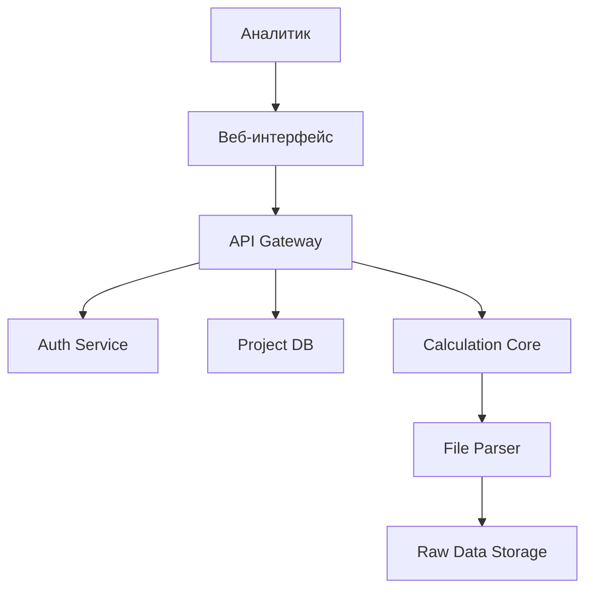

# 📚 Техническое задание CitySim

## 🏗️ Архитектура системы

### Контейнерная диаграмма (C4 Level 2)

## 🧩 Основные компоненты

### 1. Веб-интерфейс (Frontend)
**Технологии:** React / Next.js

**Функционал:**
- Визуализация карты с поддержкой слоев
- Редактор маршрутов с drag-and-drop
- Панель сравнения сценариев

### 2. API Gateway
**Технологии:** FastAPI (Python)

**Особенности:**
- RESTful API с OpenAPI 3.0 спецификацией
- Асинхронная обработка запросов
- Интеграция с Auth0 / Keycloak

### 3. Ядро расчетов
**Технологии:** Python 3.10, Pandas, NetworkX

**Метрики:**
- Расчет времени в пути
- Анализ зон покрытия
- Моделирование пассажиропотоков

### 4. Хранилища данных

| Компонент         | Технология     | Назначение                              |
|------------------|----------------|------------------------------------------|
| Основная БД       | PostgreSQL 14  | Сценарии, пользователи, метаданные       |
| Файловое хранилище| MinIO          | Исходные GTFS / CSV файлы                |
| Кэш               | Redis          | Сессии, временные результаты             |

---

## 🔧 Технологический стек

### Backend
**Языки:** Python 3.10+

**Фреймворки и инструменты:**
- FastAPI для API
- SQLAlchemy для работы с БД

**СУБД:** PostgreSQL с расширением PostGIS  
**Очереди задач:** Celery + RabbitMQ

### Frontend
**Библиотеки:**
- React 18 + TypeScript
- Deck.gl для картографической визуализации
- Chart.js для графиков

## 🔐 Безопасность

### Меры защиты

**Аутентификация:**
- JWT с 15-минутным TTL
- Refresh токены с HTTP-only флагом

**Авторизация:**
- RBAC с ролями: `Администратор`, `Аналитик`, `Наблюдатель`

**Шифрование:**
- TLS 1.3 для всех соединений
- AES-256 для файловых вложений

---

## 📡 API Спецификация

### Ключевые эндпоинты

| Метод | Путь                  | Описание                 |
|-------|-----------------------|--------------------------|
| POST  | `/auth/login`         | Получение JWT            |
| POST  | `/scenarios`          | Загрузка нового сценария |
| POST  | `/simulation`         | Запуск моделирования     |

**Пример спецификации:**

```yaml
paths:
  /simulation/{calculation_id}/results:
    get:
      summary: Получение результатов
      parameters:
        - name: calculation_id
          in: path
          required: true
```

### 🚀 Целевые показатели производительности

| Метрика               | Значение                |
|-----------------------|-------------------------|
| Время отклика API     | < 1 сек (p95)          |
| Параллельные сессии   | 1000+                  |
| Обработка файлов      | 10 МБ за ≤ 5 сек       |

### 🖥️ Минимальные требования к инфраструктуре

| Компонент             | Характеристики          |
|-----------------------|-------------------------|
| Сервер приложений     | 4 vCPU, 8 GB RAM       |
| База данных (БД)      | 2 vCPU, 16 GB RAM, SSD |
| Сеть                  | 1 Gbps, ≤ 50 ms latency|
