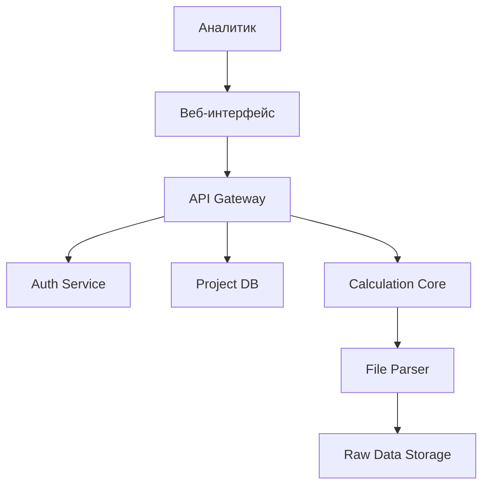

# 📚 Техническое задание CitySim

## 🏗️ Архитектура системы

### Контейнерная диаграмма (C4 Level 2)

## 🧩 Основные компоненты

### 1. Веб-интерфейс (Frontend)
**Технологии:** React / Next.js

**Функционал:**
- Визуализация карты с поддержкой слоев
- Редактор маршрутов с drag-and-drop
- Панель сравнения сценариев

### 2. API Gateway
**Технологии:** FastAPI (Python)

**Особенности:**
- RESTful API с OpenAPI 3.0 спецификацией
- Асинхронная обработка запросов
- Интеграция с Auth0 / Keycloak

### 3. Ядро расчетов
**Технологии:** Python 3.10, Pandas, NetworkX

**Метрики:**
- Расчет времени в пути
- Анализ зон покрытия
- Моделирование пассажиропотоков

### 4. Хранилища данных

| Компонент         | Технология     | Назначение                              |
|------------------|----------------|------------------------------------------|
| Основная БД       | PostgreSQL 14  | Сценарии, пользователи, метаданные       |
| Файловое хранилище| MinIO          | Исходные GTFS / CSV файлы                |
| Кэш               | Redis          | Сессии, временные результаты             |

---

## 🔧 Технологический стек

### Backend
**Языки:** Python 3.10+

**Фреймворки и инструменты:**
- FastAPI для API
- SQLAlchemy для работы с БД

**СУБД:** PostgreSQL с расширением PostGIS  
**Очереди задач:** Celery + RabbitMQ

### Frontend
**Библиотеки:**
- React 18 + TypeScript
- Deck.gl для картографической визуализации
- Chart.js для графиков

